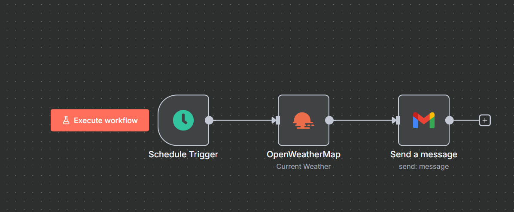

# Daily Weather Email Agent

This repository contains an n8n workflow to automate sending daily weather updates via email. The workflow uses OpenWeatherMap API to fetch current weather data for a specified city and sends it automatically through Gmail.

## Features

- Scheduled daily weather updates at a configurable time.
- Uses OpenWeatherMap API for real-time weather data.
- Sends customized email reports using Gmail.
- Easily configurable city, time, and email address.
### Sample Usage

## Setup Instructions

1. Import the workflow JSON file into your n8n instance.
2. Create credentials for OpenWeatherMap API and Gmail.
3. Configure the OpenWeatherMap node with your API key and desired city.
4. Set up Gmail node with OAuth2 credentials.
5. Activate the workflow to run automatically based on schedule.

## Technologies Used

- [n8n Workflow Automation](https://n8n.io/)
- [OpenWeatherMap API](https://openweathermap.org/api)
- Gmail API for sending emails

## Usage

Once configured and activated, the workflow will send weather update emails daily at the scheduled time.

## Contribution

Feel free to open issues or submit pull requests for improvements.

## License

This project is licensed under the MIT License.
